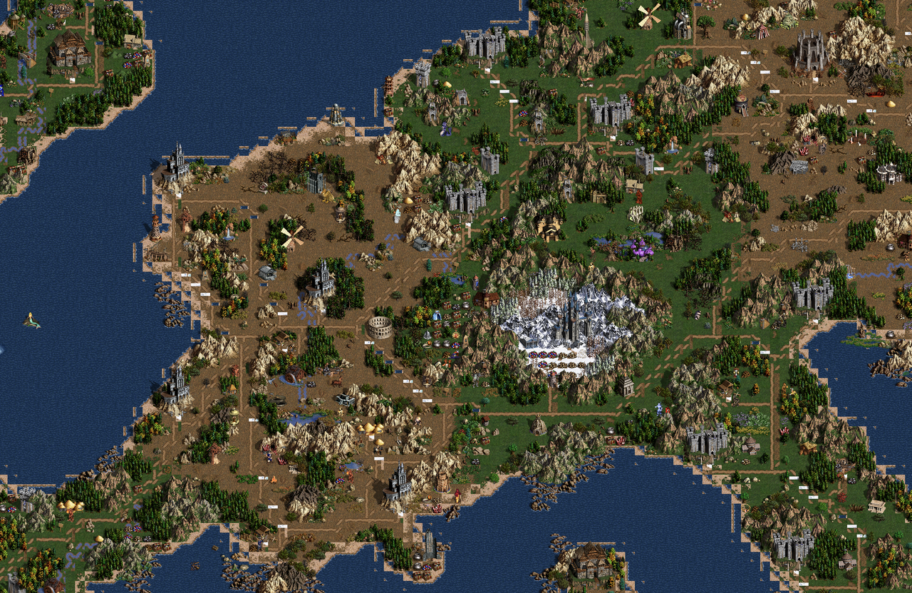

# GameWallpaper — 多游戏引擎动态壁纸（macOS + Web）

把经典游戏的地图/关卡实时渲染成桌面动态壁纸。运行时（壁纸壳）与游戏引擎解耦，
当前内置 **Heroes of Might & Magic III** 引擎，后续将接入更多游戏
（仙剑、星际争霸等，见 [docs/architecture.md](docs/architecture.md)）。

Heroes3 引擎：原版游戏素材（`H3sprite.lod`）驱动，`.h3m` 地图实时渲染——水面/岩浆
调色板动画、物件待机动画、相机自动漫游，与 VCMI 引擎的实际游戏画面一致。

| 平台 | 技术 | 入口 |
|---|---|---|
| macOS | Swift + Metal（桌面层窗口），SwiftPM 三 target | `scripts/build_app.sh` → `build/GameWallpaper.app` |
| Web | Node 零依赖服务 + HTML Canvas（地图查看器） | `cd web && npm start` → http://localhost:8765 |

> 原版游戏资源（.lod/.h3m）版权属 Ubisoft / New World Computing；**本仓库不含任何
> 游戏资源文件**，需自备（推荐装 [VCMI](https://github.com/vcmi/vcmi)）。



## 架构

```
Sources/
├── WallpaperCore/       壁纸壳（与游戏无关）：引擎协议、桌面层窗口、渲染循环、
│                        电池/休眠策略、跳点相机、About 窗口
├── Heroes3Engine/       Heroes3 引擎：lod/def/h3m 解析、图集、Metal 渲染、
│                        内置 Web 查看器、无头 CLI
└── GameWallpaper/       装配层（executable）：注册引擎 + 菜单栏 UI
```

引擎接入协议与扩展指南：**[docs/architecture.md](docs/architecture.md)**。
渲染语义细节（与 VCMI 对齐的常量/公式）：[docs/rendering.md](docs/rendering.md)、
踩坑记录：[docs/pitfalls.md](docs/pitfalls.md)。

## 使用（macOS）

```bash
# 构建（需要 Xcode，macOS 13+；本机需有 H3sprite.lod，见 docs/environment.md）
./scripts/build_app.sh
open build/GameWallpaper.app   # 菜单栏出现 🎮 图标
```

- **地图来源**：默认加载 `~/Library/Application Support/vcmi/Maps/` 下全部 `.h3m`，
  每 15 分钟自动换一张；菜单栏可「Next Map Now」「Open Map…」「Choose Maps Folder…」。
- **游戏素材**：默认读取 `~/Library/Application Support/vcmi/Data/H3sprite.lod`。
- **菜单栏设置**：缩放 1×–4×、亮度压暗 0–60%、暂停/恢复、立即切换地图。
- **渲染层级**：窗口钉在桌面层（kCGDesktopWindowLevel，Plash 同款方案）——位于壁纸
  之上、桌面图标之下，所有 Space 可见，不抢占鼠标点击。
- **省电**：显示器休眠即暂停渲染；电池供电时完全停止渲染（0fps），接电自动恢复。
- **退出**：菜单栏 → Quit。

### 验证用 CLI（无头单帧渲染）

```bash
.build/release/GameWallpaper --snapshot <map.h3m> --out snap.png \
    [--data-dir <vcmi 目录>] [--width 1920 --height 1080] [--time-ms 3000] \
    [--zoom 1] [--center-x 0.5 --center-y 0.5] [--level 0]
```

## Web 版地图查看器

`web/` 是同源逻辑的浏览器版：Node 后端（零依赖，移植同一套 lod/def/h3m 解析器，
位于 `web/server/engines/heroes3/`）+ HTML Canvas 前端，渲染完整地图，支持拖拽/
缩放/切图/动画。macOS app 菜单栏的「Map Viewer」内置同一套 HTTP API
（`/api/maps`、`/api/scene`、`/atlas/...`）。

```bash
cd web && npm start   # http://localhost:8765/
```

## 版本与发布

- 版本号格式 **`v<major>.<minor>`**（git tag，如 `v1.0`），tag 与 Release 一一对应。
- push tag 后 GitHub Actions 自动：双架构构建 → 打包 dmg（无内置资源的 lite 版）→
  生成更新说明（自上个 tag 以来的 feat/fix 分组）→ 发布 GitHub Release。
  见 [.github/workflows/release.yml](.github/workflows/release.yml)。
- 发版流程：

  ```bash
  git tag v1.1 && git push origin v1.1
  ```

- 本地构建可覆盖版本：`MARKETING_VERSION=1.1 BUILD_NUMBER=42 ./scripts/build_app.sh`。

## 已知限制 / 后续

- 只渲染地表层（underground 层已解析，可在 WallpaperPresenter 里切换 level=1）。
- 英雄/旗帜未做玩家色染色（def 索引 5 已留位）；每 15 分钟换图时可加 underground 轮换。
- 战争迷雾、英雄移动动画不适用（壁纸无游戏状态）。
- dmg 为未签名构建：首次打开若被 Gatekeeper 拦截，右键 → Open，或
  `xattr -d com.apple.quarantine /Applications/GameWallpaper.app`。

## 参考

- [VCMI](https://github.com/vcmi/vcmi)（渲染语义与格式权威参考）
- [IlyaPomaskin/h3lwp](https://github.com/IlyaPomaskin/h3lwp)（Android 版 Heroes 3
  live wallpaper，本项目解析器/图层行为的基线）
